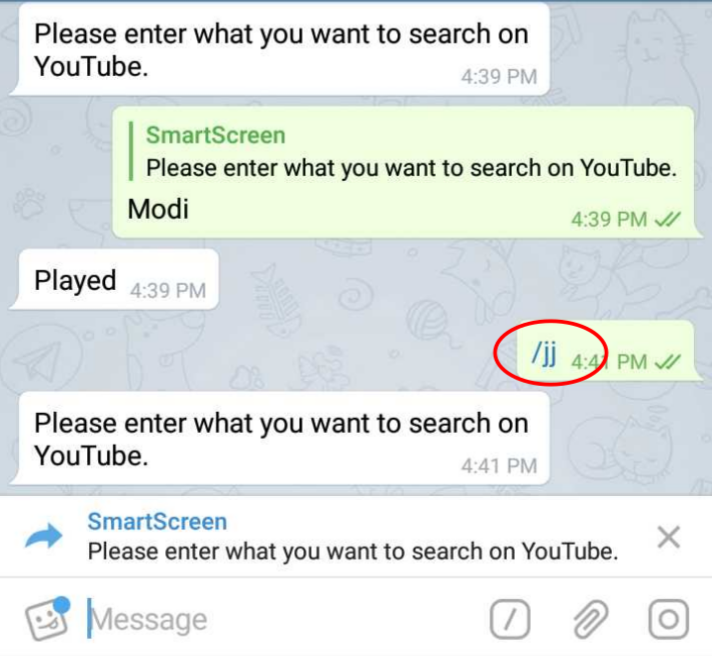
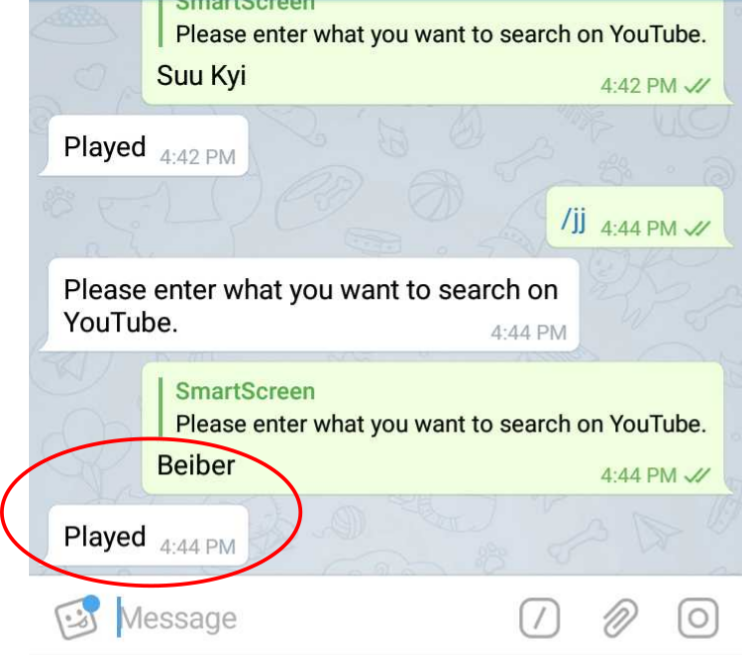

# /jj

##  Play a _video_ on the _SmartScreen_ using _jujue_ streaming service

 Provide the _keyword_ for _jujue_ to play a _video_ on

 The corresponding _video_ is played out on the _SmartScreen_

The _console_ pane on the right of the screen _displays_ the _actions_ taken and the corresponding _return_ _status_ _codes & messages_

_P.S.: While you can see every single detail of the 'action' initiated by you on the console, every 'successful push' to SmartScreen is acknowledged with a playCenter-generated ticket' and 'media' confirmation_

