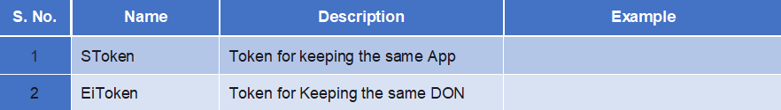

## MoteChat Helloworld

---

1. Setup _'nodejs'_ environment
2. Install _'motebus'_ npm package \(into the _"nodejs\node\_modules\npm\node\_modules"_ folder\)
3. Install _'motechat'_ npm package\(into the _"nodejs\node\_modules\npm\node\_modules"_ folder\)
4. Apply for an _'AppID'_ by project name
5. Configure the setup JSON files, _"config.json", "device.json"_ and_ "mote.json"_ located in _"/conf"_ folder

* **config.json     
  

* **device.json**  
  

* **mote.json                                
  

