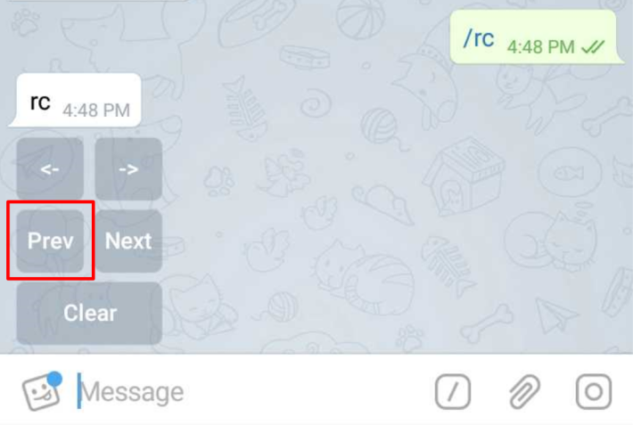
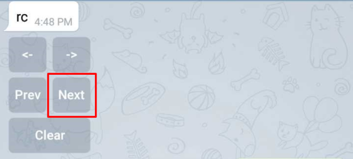
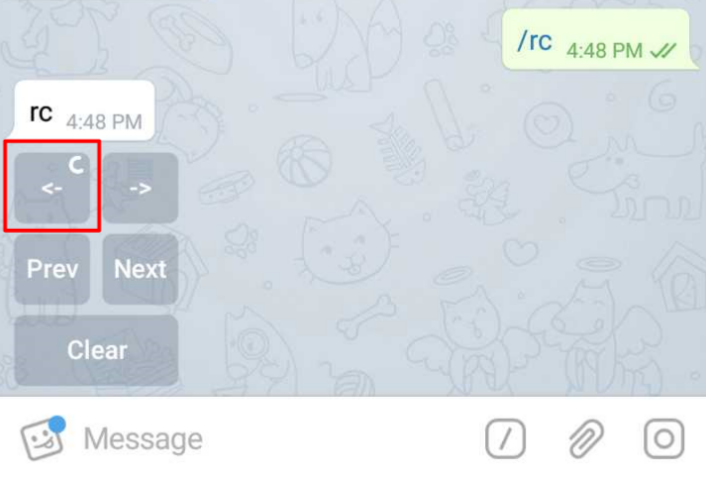
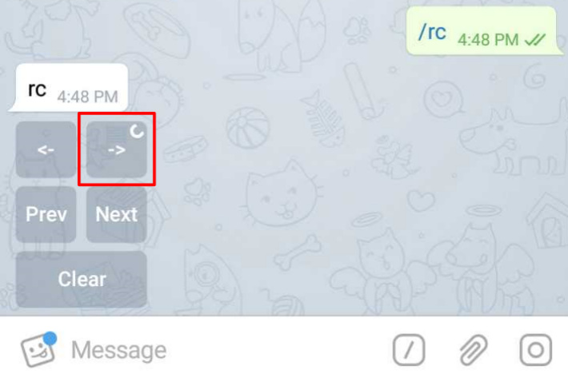
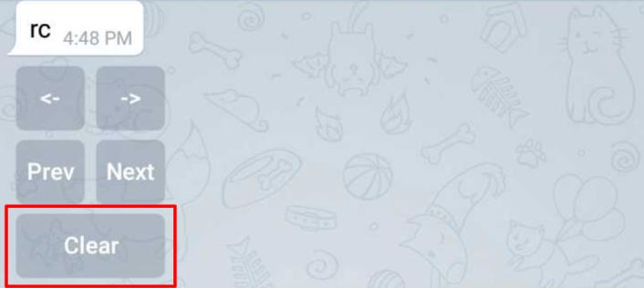

# /rc

## Play out a number of _videos_ \(say, also can push _audios, images_\) one after the other and _**navigate**_ **through** these as a _**'slideshow'**_ on _SmartScreen_ using the _**on-screen remote control**_ 

Go to the _Previous_ Video, Image or a Sound\_track

Go to the _Next_ Video, Image or a Sound\_track

Go to the _First_ Video, Image or a Sound\_track

Go to the _Last_ Video, Image or a Sound\_track

 _Clear_ the Video, Image or Sound\_track being played

