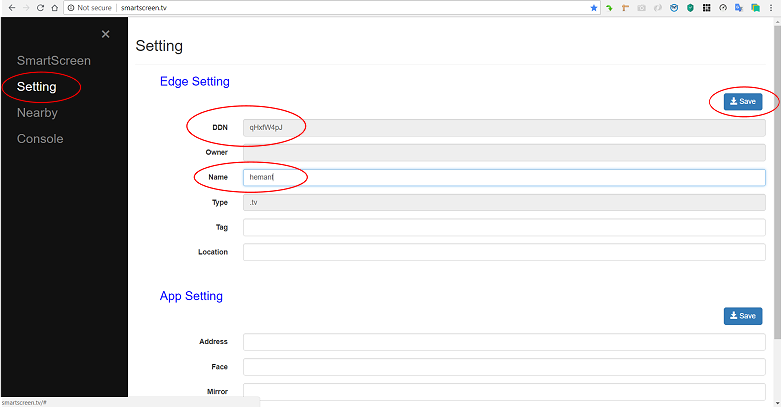

# SmartScreen Settings & Console

##  Assign a _Name_ to the SmartScreen _Target\_Device_ under _Edge Settings_ and note it's _DDN_ as shown below

##  SmartScreen _Console messages_

 It is evident in the above case that the a _youtube video_ was played _successfully_ on SS _-_ Note the _playCenter's return msg_ including the _ticket_ generated as well as the _media_ played out

