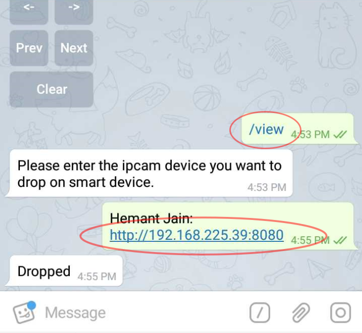

# /view

##  _**Stream**_ **IP CAM feed** _**live**_, providing the _CAM IP:port_ _\(4-byte CAM HEX ID_ to be introduced soon...\)

 The _CAM feed_ is streamed on to the _SmartScreen_ in _real-time_

