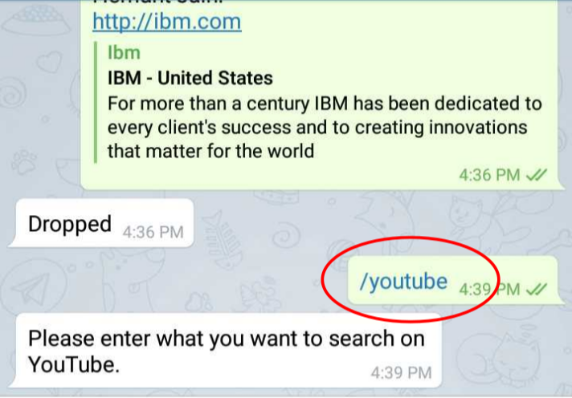
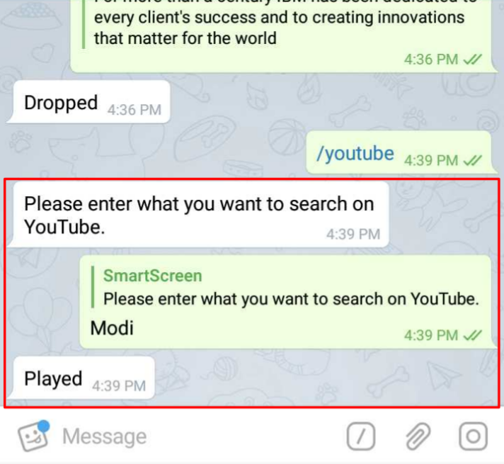
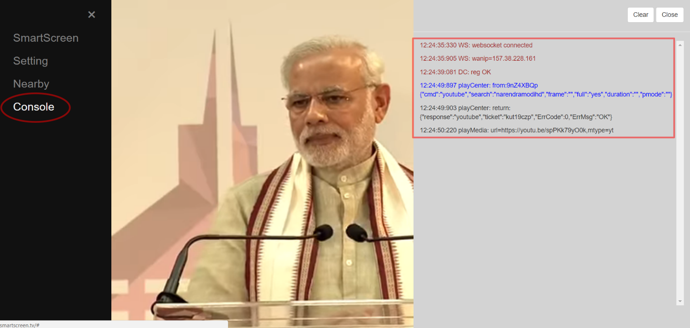

# /youtube

 Push a _video_ to be played on _SmartScreen_

 Provide the _keyword_ for the _video_ to be played upon

 Corresponding _video_ is played out on the _SmartScreen_

The _console_ pane can be opened by selecting the same on the _menu_ available on the left of the _SmartScreen_

_Console_ pane opens on the right of the _SmartScreen_ that, as you can see, _displays_ the _system messages_ starting from the SmartScreen _target\_device 'registration'_ up to '_return codes & messages'_ against the _action_ taken _\(also displayed\)_ by you

